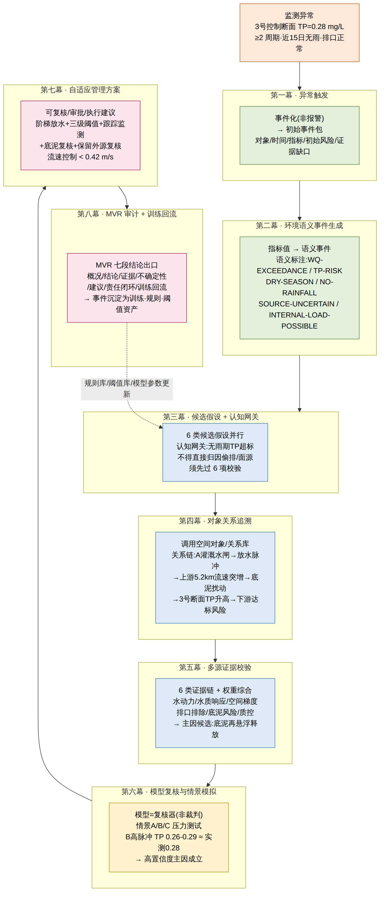
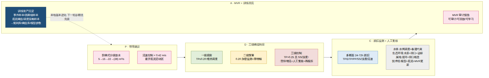
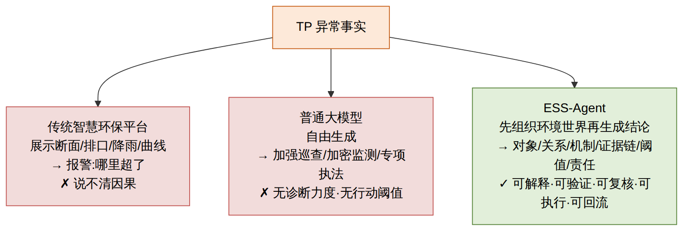
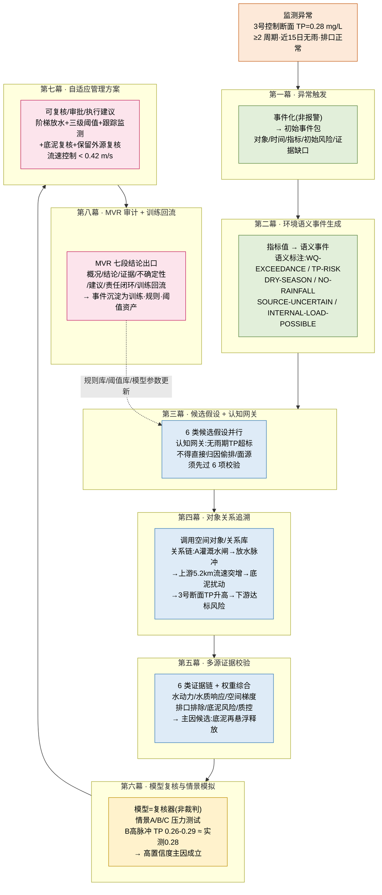
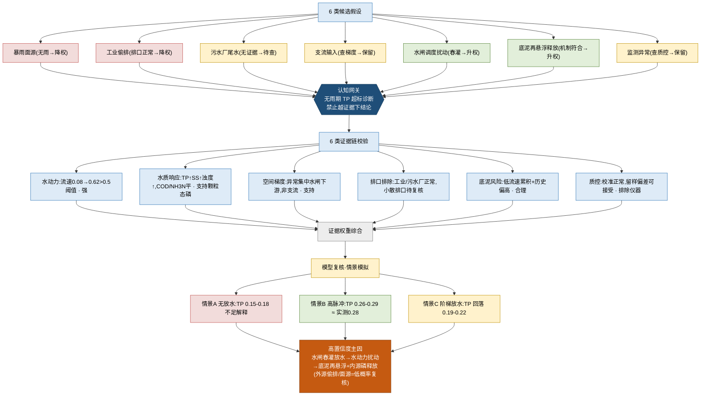
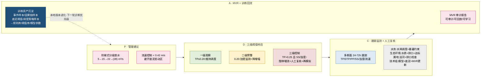
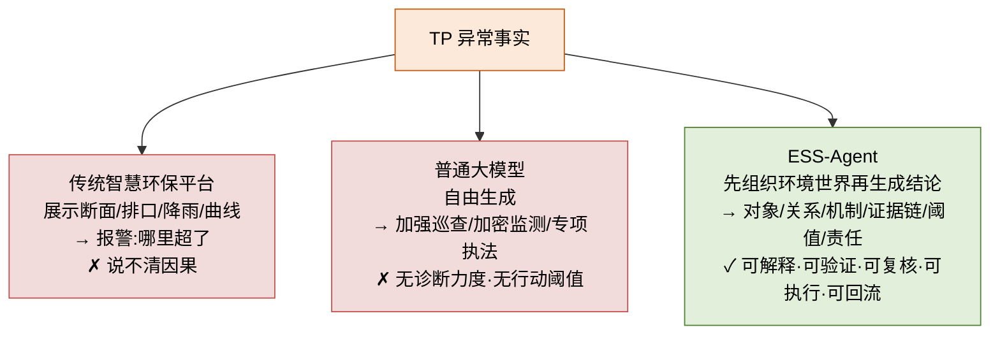

# ESS-Agent 小流域智能体场景路演 — 技术流程图

> 源方案:《ESS-Agent 应用场景路演修订阐述稿》
> 案例:涪江绵阳段某支流冬春交替期**总磷(TP)隐性超标**诊断与自适应管理
> 主线:**从一次 TP 异常 → 一条可审计治理链**(先组织环境世界,再生成结论)

---

## 0. 渲染图速览

---

## 1. 主流程:八幕端到端治理闭环

---

## 2. 认知引擎:假设收敛 → 证据归因 → 模型复核

---

## 3. 自适应管理闭环:阈值响应 + 责任复核 + 训练回流(PDCA)

---

## 4. 能力对比:为什么不是"更会回答"

---

## 5. 关键数据表(随附)

### 5.1 初始证据筛选(第三幕)

| 候选假设 | 当前证据 | 初步处理 |
|---|---|---|
| 暴雨冲刷型农业面源 | 近 15 日无明显降雨 | 降权,但不完全排除 |
| 工业异常排放 | 主要工业排口在线数据正常 | 降权,保留低概率复核 |
| 污水厂尾水异常 | 暂无同步异常证据 | 待查 |
| 支流输入 | 需检查上游支流断面梯度 | 保留 |
| 水闸调度扰动 | 冬春交替期存在春灌放水可能 | 升权 |
| 底泥再悬浮释放 | 枯水期、低流速累积后突发扰动符合机制条件 | 升权 |
| 监测异常 | 需核查设备状态和质控记录 | 保留 |

### 5.2 证据权重综合(第五幕)

| 假设 | 证据支持度 | 不确定性 | 综合判断 |
|---|---|---|---|
| 水闸放水诱发底泥再悬浮释放 | 高 | 中低 | 主因候选 |
| 支流污染输入 | 中低 | 中 | 次要待复核 |
| 工业偷排 | 低 | 中 | 暂不支持 |
| 污水厂尾水异常 | 低 | 低 | 暂不支持 |
| 暴雨冲刷农业面源 | 低 | 低 | 不支持 |
| 监测设备异常 | 低 | 低 | 不支持 |

### 5.3 管理动作表(第七幕)

| 管理动作 | 约束条件 | 监测反馈 | 人工复核 |
|---|---|---|---|
| 水闸阶梯式放水 | 3 号断面流速 < 0.42 m/s | TP、SS、浊度 6/12/24 小时响应 | 水务部门确认 |
| 暂停高脉冲放水 | TP > 0.25 mg/L 且浊度同步升高 | 下游断面是否回落 | 生态环境部门复核 |
| 底泥风险排查 | 锁定水闸下游 5.2 km 河段 | 底泥 TP 与可释放态磷 | 专家组复核 |
| 外源低强度排查 | 小散排口和支流汇入口 | 是否存在异常排水 | 属地巡查确认 |
| 模型再模拟 | 调度方案变化后 | 新一轮预测与实测误差 | 技术组复核 |

---

## 6. 七项技术优势(逐幕对应)

| 幕 | 从 → 到 |
|---|---|
| 第二幕 | 指标系统 → 语义系统(环境语义化) |
| 第三幕 | 自由生成 → 受控推理(认知网关) |
| 第四幕 | 地图查询 → 对象关系推理 |
| 第五幕 | 单点结论 → 证据链归因 |
| 第六幕 | 模型运行 → 模型审计(进证据链不凌驾) |
| 第七幕 | 诊断结论 → 治理阈值(可执行边界) |
| 第八幕 | 一次性响应 → 系统进化(训练回流) |
