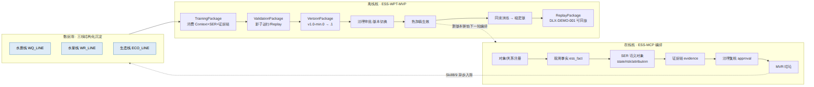
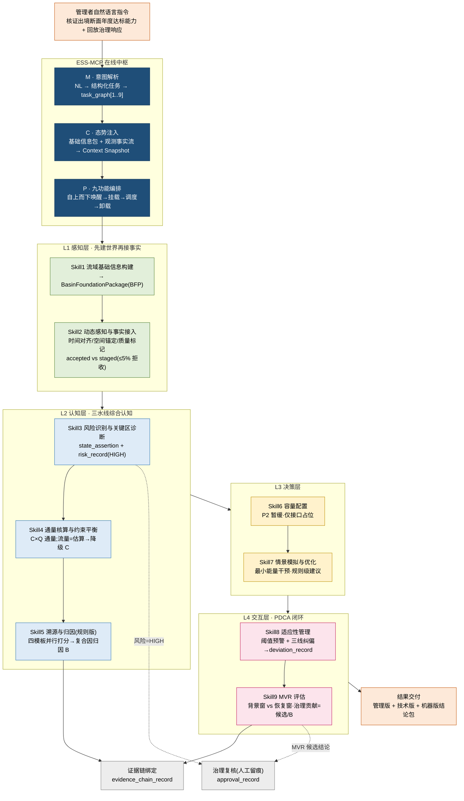
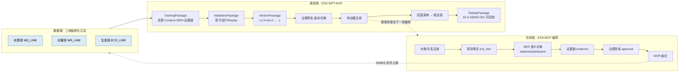
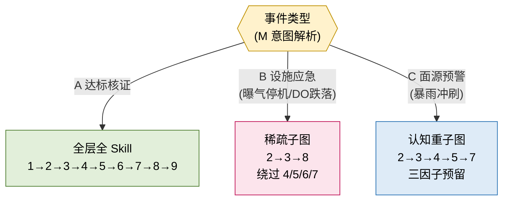

# ESS-MCP 在线编排沙盘 — 技术流程图

> 源脚本:`ess_mcp_demo.py`(DLX-DEMO-001 端到端路演)
> 架构主线:**M(意图解析)→ C(态势注入)→ P(九功能编排)**,自上而下调度 **L1→L2→L3→L4**,并贯通「在线编排 + 离线 WPT 进化」双核闭环。

> 下方代码块为 Mermaid 源(GitHub 可直接渲染);同时附 PNG 导出图于 `docs/img/`。

---

## 0. 渲染图速览

---

## 1. 主流程:DLX-DEMO-001 端到端闭环

---

## 2. 双核闭环:在线编排 → 离线 WPT 进化

**螺旋上升**:调度积累数据 → 数据驱动进化 → 进化提升调度。

---

## 3. 路由对比:同一套 MCP,事件不同 → 调度子图不同

价值:**M 解析 + P 按需编排**——同一套对象语言与中枢,按事件稀疏唤醒 Skill,用完即卸载。

---

## 4. 关键技术约束(贯穿全流程)

| 约束点 | 体现 |
|---|---|
| 先注册后接事实 | Skill1 建 BFP 世界底稿 → Skill2 才接入事实 |
| 质量准入守线 | staged 暂存而非拒绝,守 ≤5% 拒收线 |
| 数据质量传导降级 | 估算流量(Q3/staged)→ Skill4 通量降 C → Skill5 不出强负荷结论 |
| 复合因归因 | 超标主因 = 排放↑ + 稀释能力↓ 并发,非单因 |
| 窗口化核证 | MVR 用背景窗 vs 恢复窗,浓度下降需扣三因子才算净效应 |
| 高风险必复核 | risk=HIGH 与 MVR 候选结论强制进治理链人工留痕 |
| 可回放 | Replay 重建"看到/判断/为什么/谁审批/如何回滚" |
